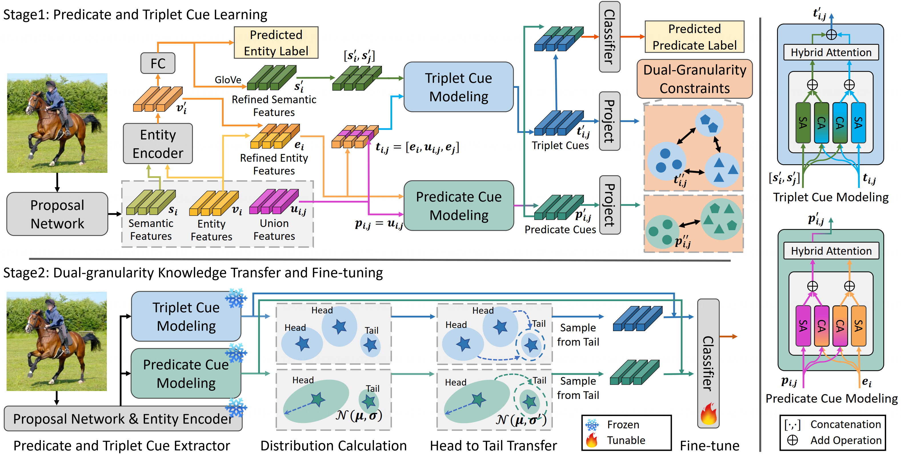

## Leveraging Predicate and Triplet Learning for Scene Graph Generation<br><sub>Official PyTorch code release for the CVPR 2024 paper: https://arxiv.org/abs/2406.02038</sub>

[](https://github.com/dongxingning/SHA_GCL_for_SGG/blob/master/LICENSE)
[](https://www.python.org/)





**Leveraging Predicate and Triplet Learning for Scene Graph Generation**<br>
Jiankai Li, Yunhong Wang, Xiefan Guo, Ruijie Yang, Weixin Li

Abstract: *Scene Graph Generation (SGG) aims to identify entities and predict the relationship triplets< subject predicate object> in visual scenes. Given the prevalence of large visual variations of subject-object pairs even in the same predicate it can be quite challenging to model and refine predicate representations directly across such pairs which is however a common strategy adopted by most existing SGG methods. We observe that visual variations within the identical triplet are relatively small and certain relation cues are shared in the same type of triplet which can potentially facilitate the relation learning in SGG. Moreover for the long-tail problem widely studied in SGG task it is also crucial to deal with the limited types and quantity of triplets in tail predicates. Accordingly in this paper we propose a Dual-granularity Relation Modeling (DRM) network to leverage fine-grained triplet cues besides the coarse-grained predicate ones. DRM utilizes contexts and semantics of predicate and triplet with Dual-granularity Constraints generating compact and balanced representations from two perspectives to facilitate relation recognition. Furthermore a Dual-granularity Knowledge Transfer (DKT) strategy is introduced to transfer variation from head predicates/triplets to tail ones aiming to enrich the pattern diversity of tail classes to alleviate the long-tail problem. Extensive experiments demonstrate the effectiveness of our method which establishes new state-of-the-art performance on Visual Genome Open Image and GQA datasets.*


## Installation

Check [INSTALL.md](INSTALL.md) for installation instructions, the recommended configuration is cuda-11.1 & pytorch-1.9.1.  

## Dataset

Check [DATASET.md](DATASET.md) for instructions of dataset preprocessing (VG & GQA & Open Image).

## Pretrained Detection Models

1. For VG dataset, the pretrained object detector we used is provided by [Scene-Graph-Benchmark](https://github.com/KaihuaTang/Scene-Graph-Benchmark.pytorch), you can download it from [this link](https://1drv.ms/u/s!AjK8-t5JiDT1kxT9s3JwIpoGz4cA?e=usU6TR). 
2. For GQA dataset, the pretrained object detector we used is provided by [SHA-GCL-for-SGG](https://github.com/dongxingning/SHA-GCL-for-SGG), you can get it from [this link](https://drive.google.com/file/d/1vimG6TZPs0pJwL2MpLM2f2pLGUuiaDNn). 
3. For Open Image dataset, the pretrained object detector we used is provided by [PySGG](https://github.com/SHTUPLUS/PySGG), you can get it from [this link](https://shanghaitecheducn-my.sharepoint.com/:u:/g/personal/lirj2_shanghaitech_edu_cn/EfGXxc9byEtEnYFwd0xdlYEBcUuFXBjYxNUXVGkgc-jkfQ?e=lSlqnz).
   


## Train on Scene Graph Generation

### Set the dataset path

Please organize all the files like this:

```bash 
datasets  
  |--vg   
    |--glove
      |--.... (glove files, will autoly download)
    |--VG_100K
      |--.... (images)
    |--VG-SGG-with-attri.h5 
    |--VG-SGG-dicts-with-attri.json
    |--image_data.json    
    |--zeroshot_triplet_0_new_order.pytorch
  |--gqa   
    |--images
      |--.... (images)
    |--GQA_200_Train.json 
    |--GQA_200_Test.json
    |--GQA_200_ID_Info.json   
  |--oiv6
    |--images
      |--.... (images)
    |--annotations  
      |--.... (annotations files)

detector_model
  |--pretrained_faster_rcnn
    |--model_final.pth
  |--GQA
    |--model_final_from_vg.pth
  |--oiv6
    |--oiv6_det.pth
```
You can specify the datasets folder location via `DATASETS.DATA_DIR` or default to `DRM/datasets`. Similarly, you can specify the location of each pretrained detector through:
``` bash
MODEL.PRETRAINED_DETECTOR_CKPT_VG 
MODEL.PRETRAINED_DETECTOR_CKPT_GQA
MODEL.PRETRAINED_DETECTOR_CKPT_OIV6
```

### Choose a dataset

You can choose the training/testing dataset by setting the following parameter:
``` bash
GLOBAL_SETTING.DATASET_CHOICE 'VG'  # ['VG', 'GQA_200', 'OIV6']
```

### Choose a task

To comprehensively evaluate the performance, we follow three conventional tasks: 1) **Predicate Classification (PredCls)** predicts the relationships of all the pairwise objects by employing the given ground-truth bounding boxes and classes; 2) **Scene Graph Classification (SGCls)** predicts the objects classes and their pairwise relationships by employing the given ground-truth object bounding boxes; and 3) **Scene Graph Detection (SGDet)** detects all the objects in an image, and predicts their bounding boxes, classes, and pairwise relationships.

For **Predicate Classification (PredCls)**, you need to set:
``` bash
MODEL.ROI_RELATION_HEAD.USE_GT_BOX True MODEL.ROI_RELATION_HEAD.USE_GT_OBJECT_LABEL True
```
For **Scene Graph Classification (SGCls)**:
``` bash
MODEL.ROI_RELATION_HEAD.USE_GT_BOX True MODEL.ROI_RELATION_HEAD.USE_GT_OBJECT_LABEL False
```
For **Scene Graph Detection (SGDet)**:
``` bash
MODEL.ROI_RELATION_HEAD.USE_GT_BOX False MODEL.ROI_RELATION_HEAD.USE_GT_OBJECT_LABEL False
```

### Examples of the Training Command

The model training process consists of two stages, the first stage corresponds to the DRM w/o DKT in the paper, and the second stage corresponds to the DRM in the paper. you can choose the training phase by setting the following parameter:
``` bash
MODEL.STAGE 'stage1'  # ['stage1', 'stage2']
```

Stage1 (DRM w/o DKT):
```bash
CUDA_VISIBLE_DEVICES=0 python -m torch.distributed.launch --master_port 10001 --nproc_per_node=1 \
    tools/relation_train_net.py \
    --config-file "configs/DRM_e2e_relation_X_101_32_8_FPN_1x.yaml" \
    GLOBAL_SETTING.DATASET_CHOICE 'VG' \
    GLOBAL_SETTING.CHOOSE_BEST_MODEL_BY_METRIC '_recall' \
    GLOBAL_SETTING.RELATION_PREDICTOR 'DRMPredictor' \
    MODEL.STAGE 'stage1' \
    MODEL.INFER_TRAIN False \
    MODEL.ROI_RELATION_HEAD.USE_GT_BOX True \
    MODEL.ROI_RELATION_HEAD.USE_GT_OBJECT_LABEL True \
    SOLVER.IMS_PER_BATCH 16 \
    SOLVER.MAX_ITER 80000 \
    SOLVER.VAL_PERIOD 5000 \
    SOLVER.CHECKPOINT_PERIOD 5000 \
    TEST.IMS_PER_BATCH 1 \
    OUTPUT_DIR ./experiments/vg_predcls
```

Extract features for calculating distribution:
```bash
CUDA_VISIBLE_DEVICES=0 python -m torch.distributed.launch --master_port 10002 --nproc_per_node=1 \
    tools/relation_infer_train.py \
    --config-file "configs/DRM_e2e_relation_X_101_32_8_FPN_1x.yaml" \
    GLOBAL_SETTING.DATASET_CHOICE 'VG' \
    GLOBAL_SETTING.CHOOSE_BEST_MODEL_BY_METRIC '_recall' \
    GLOBAL_SETTING.RELATION_PREDICTOR 'DRMPredictor' \
    MODEL.STAGE 'stage1' \
    MODEL.INFER_TRAIN True \
    MODEL.ROI_RELATION_HEAD.USE_GT_BOX True \
    MODEL.ROI_RELATION_HEAD.USE_GT_OBJECT_LABEL True \
    SOLVER.IMS_PER_BATCH 16 \
    SOLVER.MAX_ITER 80000 \
    SOLVER.VAL_PERIOD 5000 \
    SOLVER.CHECKPOINT_PERIOD 5000 \
    TEST.IMS_PER_BATCH 1 \
    OUTPUT_DIR ./experiments/vg_predcls

```

Stage2 (DRM):
```bash
CUDA_VISIBLE_DEVICES=0 python -m torch.distributed.launch --master_port 10003 --nproc_per_node=1 \
    tools/relation_train_net.py \
    --config-file "configs/DRM_e2e_relation_X_101_32_8_FPN_1x.yaml" \
    GLOBAL_SETTING.DATASET_CHOICE 'VG' \
    GLOBAL_SETTING.CHOOSE_BEST_MODEL_BY_METRIC '_mean_recall' \
    GLOBAL_SETTING.RELATION_PREDICTOR 'DRMPredictor' \
    MODEL.STAGE 'stage2' \
    MODEL.INFER_TRAIN False \
    MODEL.ROI_RELATION_HEAD.USE_GT_BOX True \
    MODEL.ROI_RELATION_HEAD.USE_GT_OBJECT_LABEL True \
    SOLVER.IMS_PER_BATCH 16 \
    SOLVER.MAX_ITER 150000 \
    SOLVER.VAL_PERIOD 5000 \
    SOLVER.CHECKPOINT_PERIOD 5000 \
    TEST.IMS_PER_BATCH 1 \
    OUTPUT_DIR ./experiments/vg_predcls
```

## Evaluation

You can download our training model (DRM_VG_Stage1_PredCls/DRM_VG_Stage2_PredCls) from [this link](https://drive.google.com/drive/folders/1T7SKD6FNlF0HA1Al8-jGo-Ngc6whpUqO?usp=drive_link). You can evaluate it by running the following command.

```bash
CUDA_VISIBLE_DEVICES=0 python -m torch.distributed.launch --master_port 10001 --nproc_per_node=1 \
    tools/relation_test_net.py \
    --config-file "configs/DRM_e2e_relation_X_101_32_8_FPN_1x.yaml" \
    GLOBAL_SETTING.DATASET_CHOICE 'VG' \
    GLOBAL_SETTING.RELATION_PREDICTOR 'DRMPredictor' \
    MODEL.STAGE 'stage1' \
    MODEL.INFER_TRAIN False \
    MODEL.ROI_RELATION_HEAD.USE_GT_BOX True \
    MODEL.ROI_RELATION_HEAD.USE_GT_OBJECT_LABEL True \
    SOLVER.IMS_PER_BATCH 16 \
    SOLVER.MAX_ITER 80000 \
    SOLVER.VAL_PERIOD 5000 \
    SOLVER.CHECKPOINT_PERIOD 5000 \
    TEST.IMS_PER_BATCH 1 \
    OUTPUT_DIR ./experiments/vg_stage1_predcls
```


## Citation
```bash
@inproceedings{li2024leveraging,
  title={Leveraging Predicate and Triplet Learning for Scene Graph Generation},
  author={Li, Jiankai and Wang, Yunhong and Guo, Xiefan and Yang, Ruijie and Li, Weixin},
  booktitle={Proceedings of the IEEE/CVF Conference on Computer Vision and Pattern Recognition},
  pages={28369--28379},
  year={2024}
}
```


## Acknowledgment

Our code is on top of [Scene-Graph-Benchmark](https://github.com/KaihuaTang/Scene-Graph-Benchmark.pytorch) and [SHA-GCL-for-SGG](https://github.com/dongxingning/SHA-GCL-for-SGG), we sincerely thank them for their well-designed codebase.
